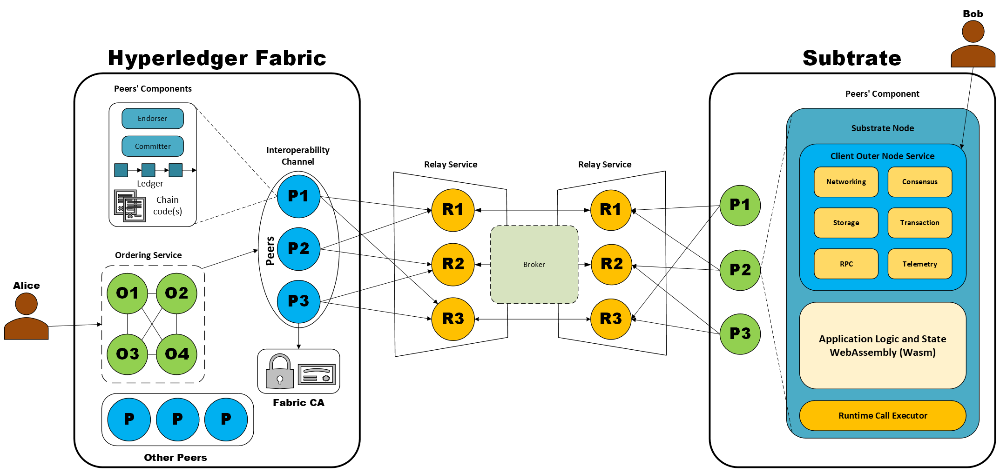

# Integrating Substrate Framework with Hyperledger Fabric for Enhanced Interoperability
## Introduction
### What Is a Blockchain Network?
There are many definitions for the term 'blockchain' that aimes to emphasis on the core features of this technology. For the sake of simplicity, we define blockchain in the following way:
A blockchain is a distributed database (a.k.a a ledger) that stores a growing and immutable list of ordered records (a.k.a blocks). These blocks are linked using cryptographical algorithms. Each block contains a cryptographic hash of the previous block, a timestamp, and transaction data.
The ledger is shared across multiple nodes (servers), and is responsible for maintaining individual operations on the network called 'transactions'. Some nodes participate in a decision-making process called 'consensus mechanism' to determine whether a given transaction is valid. Since there are no centralized authority supervising the system, there should be policies applied to the network that should be followed by all participants (users, nodes, etc.) to reach consensus. These policies are specified in something called 'smart contracts', which are self-executing pieces of code that enforce the terms of the contract between nodes.
### What Are the Different Types of Blockchain Networks?
Although there are different categorizations for blockchain networks, they are usually classified into two major types:
1. Public Blockchains: Also known as permissionless blockchain, it is a type of blockchain where anyone can join the network either as a user or as a node. All nodes are allowed to validate transactions and all users can view the ledger.
2. Private Blockchains: Also known as a permissioned blockchain, it is a type of blockchain where access to the network is restricted to only an authorized group of users. Every participating node should be identified by the organization that is operating the network.
### What is Blockchain Interoperability
Blockchain interoperability refers to the ability of different blockchain networks to communicate, share data, and interact with each other seamlessly. It aims to create a connected ecosystem where multiple blockchain platforms can work together, allowing for more efficient and versatile use of blockchain technology.
## Problem Statement
### What Problem Are We Trying to Solve?
There are multiple solutions for establishing interoperability between two different blockchain networks, such as cross-chain communication, parachains, relay chains, atomic swaps, notary schemes, etc. However, none of these solutions directly address the challenges for connecting a public blockchain to a private blockchain. As mentioned earlier, accessing the data (or specifically the ledger) on a private blockchain is restricted to a group of users autheticated and authorized by the organization running the network. This introduces a challenge for any external entity attempting to communicate.
In this work, we aim to provide a practical solution to connect a public and a private network to each other while retaining the key features of a blockchain network, especially decentralization.
## Solution
### Architecture
The diagram below outlines the specifics of the solution of our architecture:

There are two scenarios through which Alice and Bob can communicate with one another:
1. Alice (representative of a Hyperledger Fabric user) wants to share data/transfer assets to Bob (representative of a Substrate user).
2. Bob (representative of a Substrate user) wants to share data/transfer assets to Alice (representative of a Hyperledger Fabric user).

The sequential diagram of the first scenario is illustrated as follows:
1. Alice initiates a transaction on the Hyperledger Fabric network.
2. The transaction request is received by ordering services.
3. The ordering service invokes all endorsing peers, including the peers on the interoperability channel, to endorse the transaction.
4. Chaincodes installed on the peers of the interoperability channel identify the transaction as an **external transaction** (a transaction with a destination outside of the network).
5. Once the chaincodes are executed, they forward the transaction information to the relay nodes that are listening to the events of Hyperledger Fabric channel.
6. The transaction information is sent through a broker that is reponsible for discovering reliable relay nodes that are up and running.
7. The transaction information are then sent from the relay nodes to the substrate node.
8. The nodes then reach a consensus to validate the transaction.
9. Bob receives the corresponding asset and the transaction information is added to the ledger.
9. Once the transaction is executed and submitted to the Substrate network, a message is sent through the relay services back to Fabric network to confirm the execution of the transaction.
10. After confirmation, the asset sent by Alice is unlocked.

The Sequential diagram of the second scenario is illustrated as follows:
1. Bob initiates a transaction on Substrate network.
2. The transaction is received by all the network peers.
3. An interoperability smart contract is automatically executed on the nodes that have the authority to validate the transaction.
4. After validation, the peers forward this message to the corresponding relay service.
5. The relays then identify reliable relay services that can communicate with Hyperledger Fabric network through the broker.
6. The relay nodes then send the transaction information to the Hyperledger Fabric peers that are part of the interoperability channel.
7. The identity of nodes who approved the transaction on Substrate network is approved through certificate provision.
8. After certificate approval, the peers reach consensus over validating the transaction.
9. The transaction information is then added to the ledger.
10. A message is sent back to the Substrate network to acknowledge the transaction was successfully executed.
11. Finally, the asset is unlocked once the Substrate nodes receive the acknowledgement message.